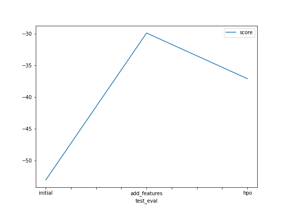

# Report: Predict Bike Sharing Demand with AutoGluon Solution
#### Swarangi Sharad Patil

## Initial Training
### What did you realize when you tried to submit your predictions? What changes were needed to the output of the predictor to submit your results?
When the training model was used without any Exploratory Data Analysis or changes to hyperparameters, the model did not perform very well. It resulted in a score of 1.79488 on kaggle. Before submitting to kaggle it is mandatory to handle the negative or null values. One thing needed is probably more time training the model. The model would perform much better with additional time. However, if the time is to be kept constant, we can try adding features and categorizing data which arent actually integers. Then we can fine tune using the hyperparameters. 
Hyperparamters were set for LGBM, CAT and XGBoost models in the following manner:
```
gbm_options = {  
    'num_boost_round': 100,  
    'num_leaves': ag.space.Int(lower=26, upper=66, default=36), 
}  
search_strategy = 'auto'
number_of_trials = 3
hyperparameter_tune_kwargs = { 
    'num_trials': number_of_trials,
    'scheduler' : 'local',
    'searcher': search_strategy,
}

hyperparameters = {
    'GBM': gbm_options, 
    'XGB': {'n_estimators': 1000, 'learning_rate': ag.Real(0.01, 0.1, log=True)}, 
    'CAT':{"learning_rate": ag.Real(0.00001, 0.1,log=True),"iterations": ag.space.Int(50, 1000),"early_stopping_rounds": ag.space.Int(1, 10),"depth": ag.space.Int(1, 10),"l2_leaf_reg": ag.space.Int(1, 10),"random_strength": ag.Real(0.01, 10, log=True),}
} 
```

### What was the top ranked model that performed?
The best performing model was found to be WeightedEnsemble_L3 
The first 10 entries appeared as:
*** Summary of fit() ***
Estimated performance of each model:
|Sr No|                     model|   score_val|  pred_time_val|    fit_time  pred_time_val_marginal|fit_time_marginal|  stack_level|  can_infer|  fit_order|
|--|--|--|--|--|--|--|--|--|
|0|      WeightedEnsemble_L3|  -53.034291 |     15.471861|  562.650426|                0.001647|           0.525357|            3       |True|         14|
|1|   RandomForestMSE_BAG_L2 | -53.325812  |    11.766578|  422.999214|                0.636629|          27.519060|            2       |True|         12|
|2|          LightGBM_BAG_L2|  -55.221366|      11.458005|  422.298478|                0.328056|          26.818325|            2       |True   |      11|
|3|          CatBoost_BAG_L2|  -55.635274|      11.188963|  450.750823|                0.059014|          55.270669|            2|       True|         13|
|4|        LightGBMXT_BAG_L2|  -60.072782 |     14.446516|  452.517016|                3.316566|          57.036862|            2 |      True  |       10|
|5|    KNeighborsDist_BAG_L1|  -84.125061|       0.105139|    0.049299|                0.105139|           0.049299|            1|       True|          2|
|6|      WeightedEnsemble_L2|  -84.125061|       0.106282|    0.630754|                0.001143|           0.581455|            2|       True|          9|
|7|    KNeighborsUnif_BAG_L1 |-101.546199|       0.103344|    0.036244|                0.103344|           0.036244|            1     |  True|          1|
|8|   RandomForestMSE_BAG_L1| -116.544294|       0.567706|   11.167113|                0.567706|          11.167113|            1       |True|          5|
|9|     ExtraTreesMSE_BAG_L1| -124.588053 |      0.559922|   5.256219|                0.559922|           5.256219|            1    |   True |         7|


## Exploratory data analysis and feature creation
### What did the exploratory analysis find and how did you add additional features?
Along with the basic statistical functions like min, max, variance, for exploratory analysis, histogram was plotted along with correlation matrix. Data Wrangler makes it easy to visualise the histogram for each column. The additional feature that could be extracted was the datetime split. DateTime can be split into year and month, time and hour providing more features to train the model with.


### How much better did your model preform after adding additional features and why do you think that is?
There was a slight improvement in the performance of the model after adding year and month as separate features. This part comprises of feature engineering. Removing the casual and registered columns as they are not significant and addition of year, hour and month as additional features. A model needs enough features so that it does not overfit or underfit. Thus the addition of the feature improves the overall performance of the model.


## Hyper parameter tuning
### How much better did your model preform after trying different hyper parameters?
Analysing the initial scores for the models LGBM, XGB,CAT vs the scores after hyperparameter tuning, we notice that their performance has improved. Eg, initial performance for LGBM was -55.221366. After hyperparameter tuning it improves to -37.424359. Let us see the Leaderboard to verify this:

Initial Leaderboard:


After Hyperprameter Tuning:


Kaggle score comparison can be visualised here:


### If you were given more time with this dataset, where do you think you would spend more time?
Given more time, I would try multiple rounds of tuning the hyperparameters. Increasing the training time of the model would also help to improve the performance.

### Create a table with the models you ran, the hyperparameters modified, and the kaggle score.

|model|LGBM|XGB|CAT|score|
|--|--|--|--|--|
|initial|-55.221366|-|-55.635274|1.79488|
|add_features|-29.904200|-|-30.837565|1.24240|
|hpo|-37.424359|-37.384729|-38.417834|1.18063|

Comparison of Models after Hyperparameter tuning


### Create a line plot showing the top kaggle score for the three (or more) prediction submissions during the project.
The kaggle score for best performing model:



## Summary
The model was trained using Autogluon to find the bike sharing demand. With additional features, the performance of the model is enchanced. Fine tuning the hyperparameters can be tedious but affects the performance of the model significantly.
